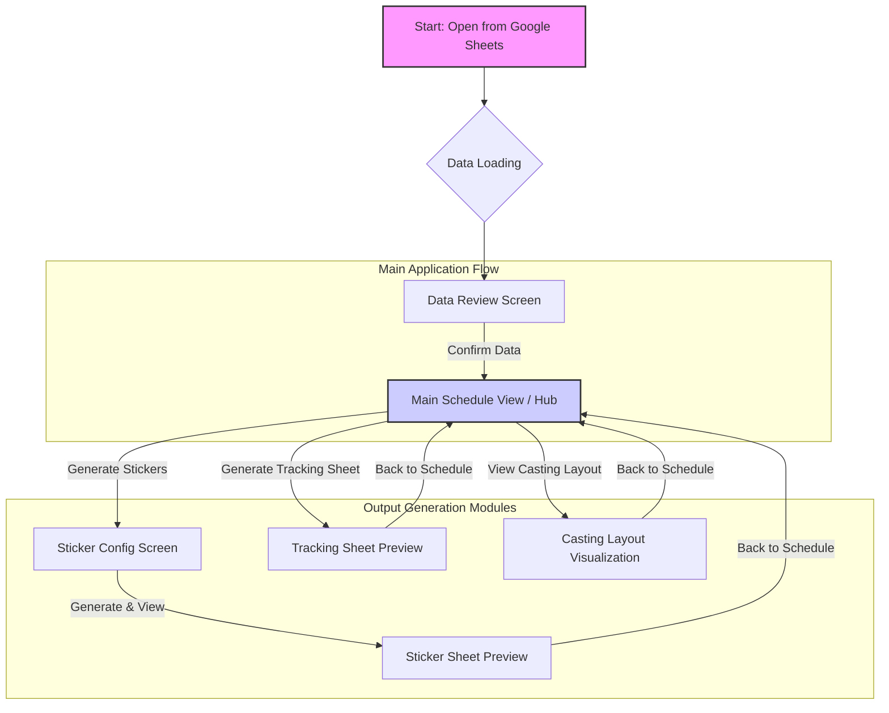

# Navigation Design Document: CWE Production Dashboard

## 1. Overview

This document outlines the navigation structure and user flow for the CWE Production Dashboard. The application is a single-page web app embedded within a Google Sheet modal dialog. Its primary purpose is to process production data from the sheet, display it in various formats (schedules, tracking sheets, stickers), and provide an interactive tool for visualizing casting layouts. The navigation is stateful, guiding the user through a sequential process from data loading to output generation.

## 2. Navigation Narrative & User Journey

The application employs a "Stateful Wizard" navigation model. This linear, sequential approach guides the user through a multi-step process, ensuring data is handled correctly and minimizing cognitive load. The user journey is a sequence of well-defined screens, with transitions controlled by specific actions.

1.  **Initiation:** The user opens the dashboard from the "CWE Tools" > "Open CWE Dashboard" menu in Google Sheets.
2.  **Loading:** A loading overlay (`#loading-overlay`) is immediately displayed while the application fetches and processes data from the active sheet using the `getSheetData()` backend function.
3.  **Data Review:** Once data is processed, the application presents the **Data Review Screen** ([`#review-container`](index.html:417)). Here, the user verifies the parsed data from the "Project Information," "Panel Legend," and "Casting Schedule" tabs.
4.  **Confirmation & Transition to Hub:** After reviewing the data, the user clicks "Confirm and Generate Schedule." This action transitions the application to its central hub.
5.  **Main Hub (Schedule View):** The **Main Schedule View** ([`#output`](index.html:433)) is displayed. This view acts as the primary hub from which all data generation tasks are initiated. The main navigation bar ([`#output-controls`](index.html:70)) becomes visible, providing access to all sub-modules.
6.  **Output Generation (User's Choice):** From the main hub, the user can choose to navigate to several specialized sub-views:
    *   **Generate Stickers:** Navigates to the **Sticker Configuration Screen** ([`#sticker-settings-container`](index.html:437)) to set layout options, then proceeds to the **Sticker Sheet Preview** ([`#sticker-sheet-container`](index.html:481)).
    *   **Generate Tracking Sheet:** Navigates directly to the **Tracking Sheet Preview** ([`#tracking-sheet-container`](index.html:482)).
    *   **View Casting Layout:** Navigates to the interactive **Casting Layout Visualization** ([`#casting-layout-container`](index.html:483)).
7.  **Return to Hub:** From any sub-view (Stickers, Tracking, Layout), the user can click the "Back to Schedule" button to return to the **Main Schedule View**, reinforcing its role as the central hub.

## 3. User Interface Views

The application consists of several distinct views or "screens" that are shown or hidden based on user actions.

### 3.1. Loading Screen

-   **ID:** `#loading-overlay`
-   **Description:** A modal overlay with a spinner that appears while the application is fetching data from the Google Sheet. This provides feedback that the application is working.

### 3.2. Data Review Screen

-   **Container IDs:** [`#review-container`](index.html:417), [`#review-actions`](index.html:413)
-   **Description:** The initial screen presented to the user after data loading. It displays the parsed "Project Information", "Panel Legend", and "Casting Schedule" in tables for verification.
-   **Actions:**
    -   "Confirm and Generate Schedule": Proceeds to the Main Schedule View.
    -   "Back": Resets and reloads the entire application.

### 3.3. Main Schedule View

-   **Container ID:** [`#output`](index.html:433)
-   **Description:** The central hub of the application, displaying the finalized casting schedule organized by cast number. The main navigation bar is visible at the top.
-   **Entry Point:** Accessed after clicking "Confirm and Generate Schedule" on the review screen.

### 3.4. Sticker Configuration Screen

-   **Container ID:** [`#sticker-settings-container`](index.html:437)
-   **Description:** A form that allows the user to configure layout settings for printable sticker sheets (e.g., sticker dimensions, margins, columns, rows).
-   **Entry Point:** Accessed by clicking the "Generate Stickers" button from the Main Schedule View.

### 3.5. Sticker Sheet Preview

-   **Container ID:** [`#sticker-sheet-container`](index.html:481)
-   **Description:** Displays a preview of the generated sticker sheets based on the schedule data and layout settings.
-   **Entry Point:** Accessed after clicking "Generate & View Stickers" from the Sticker Configuration screen.

### 3.6. Tracking Sheet Preview

-   **Container ID:** [`#tracking-sheet-container`](index.html:482)
-   **Description:** Displays printable tracking sheets, with one row for each unique panel instance, organized by cast.
-   **Entry Point:** Accessed by clicking the "Generate Tracking Sheet" button from the Main Schedule View.

### 3.7. Casting Layout Visualization

-   **Container ID:** [`#casting-layout-container`](index.html:483)
-   **Description:** An interactive view that renders each cast's layout on a `<canvas>`. Users can drag, rotate, save, and load form positions.
-   **Entry Point:** Accessed by clicking the "View Casting Layout" button from the Main Schedule View.

## 4. Navigation Controls

Navigation is handled by a set of buttons that change visibility and function based on the current view.

### 4.1. Main Navigation Bar (`#output-controls`)

This is the primary navigation element, visible in most views after the initial data review.

-   **Back to Review (`#back-to-review-button`):** Returns the user to the Data Review Screen.
-   **Back to Schedule (`#back-to-schedule-button`):** Appears in the Sticker, Tracking, and Layout views. Returns the user to the Main Schedule View, acting as the primary "back" button from sub-views.
-   **Generate Stickers (`#generate-stickers-button`):** Navigates to the Sticker Configuration Screen.
-   **Generate Tracking Sheet (`#generate-tracking-sheet-button`):** Navigates to the Tracking Sheet Preview.
-   **View Casting Layout (`#view-layout-button`):** Navigates to the Casting Layout Visualization screen.

### 4.2. Contextual Buttons

These buttons appear dynamically based on the user's context.

-   **Print Schedule (`#print-schedule-button`):** Prints the content of the Main Schedule View.
-   **Print Stickers (`#print-stickers-button`):** Appears in the Sticker Sheet Preview.
-   **Print Tracking Sheet (`#print-tracking-sheet-button`):** Appears in the Tracking Sheet Preview.
-   **Print Layout (`#print-layout-btn`):** Appears in the Casting Layout Visualization view.

## 5. User Flow Diagram

